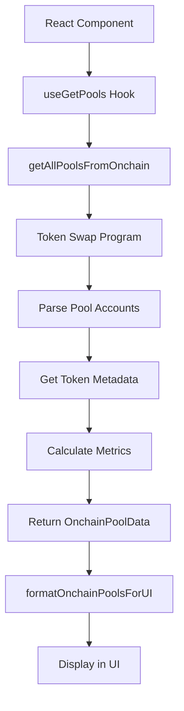

# Liquidity Pool Onchain Implementation

## 🎯 Overview

This module provides **onchain liquidity pool data fetching** for BBAChain network, replacing the previous Raydium API-based approach. All pool data is now fetched directly from the BBAChain Token Swap Program.

## 🏗️ Architecture

```
📁 src/features/liquidityPool/
├── 📄 onchain.ts       # Onchain data fetching utilities
├── 📄 services.ts      # React Query hooks
├── 📄 utils.ts         # Data formatting utilities
├── 📄 types.ts         # TypeScript definitions
└── 📄 components/      # UI components
```

## 🔧 Key Components

### 1. **Onchain Data Fetching** (`onchain.ts`)

```typescript
import { getAllPoolsFromOnchain } from '@/features/liquidityPool/onchain'

// Get all pools from onchain
const pools = await getAllPoolsFromOnchain(connection)
```

### 2. **React Query Hook** (`services.ts`)

```typescript
import { useGetPools } from '@/features/liquidityPool/services'

// Use in React component
const { data, isLoading, error } = useGetPools()
```

### 3. **Data Formatting** (`utils.ts`)

```typescript
import { formatOnchainPoolsForUI } from '@/features/liquidityPool/utils'

// Convert onchain data to UI format
const uiData = formatOnchainPoolsForUI(onchainPools)
```

## 📊 Data Flow



## 🔍 Implementation Details

### Program Account Discovery

```typescript
// Fetch all token swap program accounts
const accounts = await connection.getProgramAccounts(TOKEN_SWAP_PROGRAM_ID, {
	filters: [{ dataSize: TokenSwapLayout.span }]
})
```

### Pool Data Parsing

```typescript
// Parse account data using buffer layout
const swapData = TokenSwapLayout.decode(accountData)
```

### Token Metadata Resolution

```typescript
// Get mint information from onchain
const mint = await getMint(connection, mintAddress)
```

### TVL Calculation

```typescript
// Calculate Total Value Locked
const tvl = calculateTVL(reserveA, reserveB, mintA, mintB, priceA, priceB)
```

## 🚀 Usage Examples

### Basic Pool Fetching

```typescript
import { useGetPools } from '@/features/liquidityPool/services'
import { formatOnchainPoolsForUI } from '@/features/liquidityPool/utils'

function PoolsList() {
  const { data, isLoading, error } = useGetPools()

  if (isLoading) return <div>Loading pools...</div>
  if (error) return <div>Error loading pools</div>

  const pools = formatOnchainPoolsForUI(data.data)

  return (
    <div>
      {pools.map(pool => (
        <div key={pool.id}>
          {pool.mintA.symbol}-{pool.mintB.symbol}
          TVL: ${pool.liquidity.toLocaleString()}
        </div>
      ))}
    </div>
  )
}
```

### Pool Statistics

```typescript
import { getPoolStatistics } from '@/features/liquidityPool/utils'

const stats = getPoolStatistics(pools)
console.log(`Total TVL: $${stats.totalLiquidity.toLocaleString()}`)
```

### Filtering and Sorting

```typescript
import { filterPools, sortPools } from '@/features/liquidityPool/utils'

// Filter pools by search term
const filtered = filterPools(pools, 'USDC')

// Sort by liquidity (highest first)
const sorted = sortPools(filtered, 'liquidity', 'desc')
```

## 🔧 Configuration

### Query Options

```typescript
// Customize React Query behavior
const { data } = useGetPools({
	staleTime: 60000, // 1 minute
	refetchInterval: 300000, // 5 minutes
	retry: 3
})
```

### Error Handling

```typescript
const { data, error, isError } = useGetPools()

if (isError) {
	console.error('Pool fetching failed:', error.message)
}
```

## 📈 Metrics Calculation

### Current Implementation

- **TVL**: Sum of token reserves (simplified)
- **Volume 24h**: Estimated from TVL (placeholder)
- **Fees 24h**: Volume × Fee Rate
- **APR 24h**: (Fees × 365) / TVL × 100

### Future Enhancements

- **Historical transaction tracking**
- **Real-time price feeds**
- **Volume calculation from swap events**
- **Advanced yield farming metrics**

## 🧪 Testing

### Manual Testing

```typescript
// Test onchain data fetching
import { getAllPoolsFromOnchain } from '@/features/liquidityPool/onchain'

const testPools = async () => {
	const pools = await getAllPoolsFromOnchain(connection)
	console.log(`Found ${pools.length} pools`)
}
```

### Error Scenarios

- ✅ Network failures
- ✅ Invalid account data
- ✅ Missing token metadata
- ✅ Zero reserves handling

## 🔄 Migration from Raydium API

### Before (API-based)

```typescript
// ❌ Old way: External API dependency
const pools = await fetch('https://api-v3.raydium.io/pools/info/list')
```

### After (Onchain)

```typescript
// ✅ New way: Direct onchain access
const pools = await getAllPoolsFromOnchain(connection)
```

### Benefits

- 🔐 **Trustless**: No external API dependencies
- ⚡ **Real-time**: Direct blockchain access
- 🎯 **Network-specific**: BBAChain native pools only
- 📊 **Accurate**: Live reserves and metrics

## 🛠️ Troubleshooting

### Common Issues

1. **No pools found**

   - Check if Token Swap Program has any accounts
   - Verify `TOKEN_SWAP_PROGRAM_ID` is correct

2. **Parsing errors**

   - Ensure `TokenSwapLayout` matches program structure
   - Check account data size filters

3. **Token metadata missing**
   - Normal for new/unlisted tokens
   - Fallback to address-based identifiers

### Debug Mode

```typescript
// Enable detailed logging
console.log('🔄 Fetching pools from onchain...')
console.log(`📊 Found ${poolAccounts.length} pool accounts`)
console.log(`✅ Successfully processed ${pools.length} valid pools`)
```

## 🚀 Performance Optimizations

### Batch Processing

- Process accounts in batches of 10
- Parallel mint info fetching
- Efficient error handling

### Caching Strategy

- React Query automatic caching
- 1-minute stale time
- 5-minute refetch interval

### Future Optimizations

- **WebSocket subscriptions** for real-time updates
- **GraphQL indexer** for historical data
- **Redis caching** for high-traffic scenarios

## 📋 TODO

- [ ] Add price feed integration
- [ ] Implement historical volume tracking
- [ ] Add LP token price calculation
- [ ] Create pool performance analytics
- [ ] Add yield farming metrics
